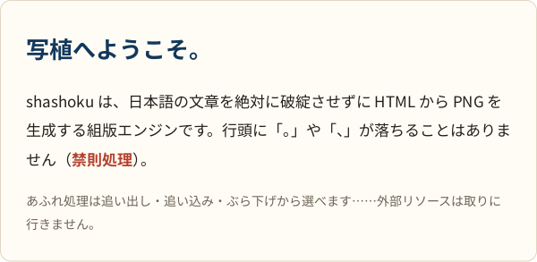

# shashoku（写植）

**日本語の文章を絶対に破綻させずに、HTML から PNG を一発で生成する組版エンジン。**

禁則処理・縦書き・ルビ・フォントフォールバックを備え、関数 1 個で PNG バイト列を返す C++23 ライブラリ。
OG 画像のように「任意の日本語文字列を流し込んでも組版が壊れない」ことを保証するのが目的。

> 🚧 開発中（Phase 5 まで完了）。HTML → PNG は一気通貫で動きます。
> block / inline レイアウト・禁則処理・`<style>` と単純セレクタ・フォールバック・scale まで対応。
> flexbox（Phase 6）・ルビ（Phase 7）・縦書き（Phase 8）はこれからです。
> 設計は [docs/DESIGN.md](docs/DESIGN.md) と [docs/ARCHITECTURE.md](docs/ARCHITECTURE.md) を参照。



## 使い方

### C++

```cpp
#include "shashoku/shashoku.hpp"

shashoku::FontSet fonts;
fonts.add(noto_sans_jp_bytes);   // 追加順がフォールバック順。バイト列で渡す

shashoku::RenderOptions options;
options.viewport_width = 600;    // 高さは内容に追従（指定もできる）

const auto result = shashoku::render(html, fonts, options);
if (!result) {
  std::cerr << shashoku::to_string(result.error()) << '\n';  // error[unsupported-property] at 3:14: ...
  return 1;
}
for (const shashoku::Warning& w : result->warnings) {   // 豆腐（グリフ欠落）だけは警告
  std::cerr << w.detail << '\n';
}
write_file("out.png", result->png);                     // PNG のバイト列
```

リンクするのは `shashoku::shashoku` 1 つだけ。`include/shashoku/` のヘッダは公開 API だけを見せ、
FreeType / HarfBuzz や内部の型は一切漏れません。ネットワークにもファイルシステムにも触れないので、
フォントと画像はバイト列で渡します（`ImageSet` で名前を付けると `` で引けます）。

同じ入力からは常にバイト単位で同じ PNG が出ます（純粋関数）。

### CLI

```bash
shashoku examples/hello.html --font NotoSansJP-Regular.otf -o out.png --width 600
shashoku input.html --font A.otf --font B.ttf --image icon=icon.png -o out.png --scale 2
shashoku input.html --font A.otf --overflow burasage -o out.png   # あふれ処理を選ぶ
shashoku input.html --font A.otf --dump-stage box                 # 中間表現を見る
```

`--dump-stage` は `dom | style | box | display-list | svg` を受け取り、各段の中間表現を
JSON（SVG）で出します。終了コードは 0 成功 / 1 レンダリングエラー / 2 引数の誤り。

## ビルド

必要なもの: CMake 3.22+ / Ninja / clang-18 + libc++-18（C++23 の `std::expected` を使うため）

```bash
# Ubuntu 22.04（apt.llvm.org の llvm-toolchain-jammy-18 リポジトリが必要）/ 24.04
sudo apt install ninja-build clang-18 clang-format-18 clang-tidy-18 libc++-18-dev libc++abi-18-dev pngcheck
```

```bash
cmake --preset dev
cmake --build --preset dev
ctest --preset dev
```

GCC を使う場合は 13 以上: `CXX=g++-14 cmake --preset gcc`

## やらないこと

JavaScript の実行 / 外部リソースの取得 / grid・float・table / CJK 以外の複雑スクリプト / ブラウザとのピクセル一致。
対応外のタグ・CSS は黙って無視せず、エラーで落とします（fail loudly）。詳細は [DESIGN.md §4](docs/DESIGN.md)。
