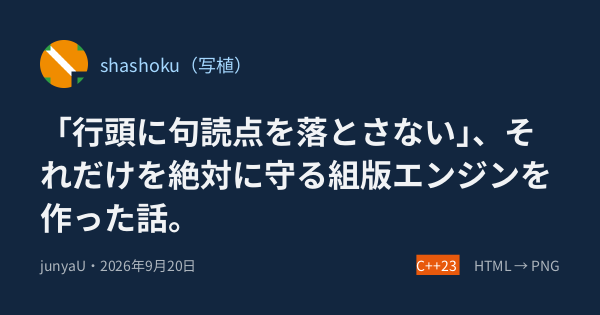
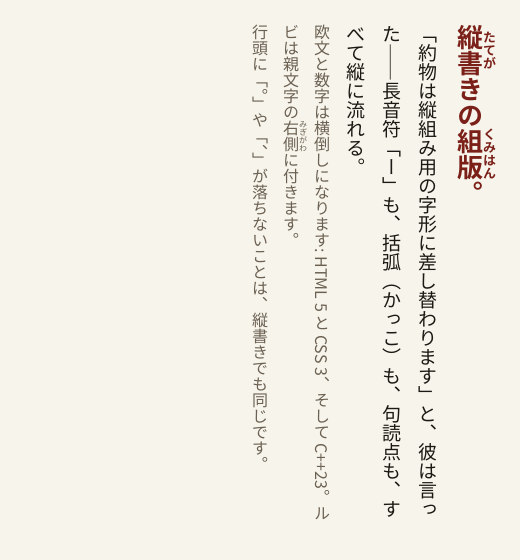
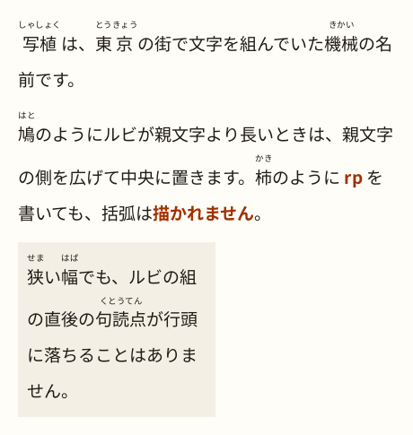

# shashoku（写植）

**日本語の文章を絶対に破綻させずに、HTML から PNG を一発で生成する組版エンジン。**

禁則処理・縦書き・ルビ・フォントフォールバックを備え、関数 1 個で PNG バイト列を返す C++23 ライブラリ。
OG 画像のように「任意の日本語文字列を流し込んでも組版が壊れない」ことを保証するのが目的。

> 🚧 **Phase 8 まで実装済み**。HTML → PNG が一気通貫で動きます。
> block / inline / flexbox レイアウト、禁則処理（追い出し・追い込み・ぶら下げ）、
> `<style>` と単純セレクタ、``、**ルビ**、**縦書き**、フォントフォールバックと豆腐検出、
> scale まで対応。残るは配布まわり（Phase 9）です。
> 設計は [docs/DESIGN.md](docs/DESIGN.md) と [docs/ARCHITECTURE.md](docs/ARCHITECTURE.md) を参照。



<sub>[examples/og_card.html](examples/og_card.html) を 1200×630 で組んだもの（この画像は 600×315）。
flexbox で「アイコン + タイトル + フッター」を組み、行頭に句読点が落ちないことを保証します。</sub>

## 縦書きとルビ

`writing-mode: vertical-rl` で縦組みになります。約物は縦組み用の字形に差し替わり、
欧文と数字は横倒しになり、ルビは親文字の右側に付きます。禁則は縦書きでも同じように働きます。

| 縦書き（[examples/vertical.html](examples/vertical.html)） | ルビ（[examples/ruby.html](examples/ruby.html)） |
|---|---|
|  |  |

`<ruby>` は `<rt>` を複数書けばモノルビになります（`<ruby>東<rt>とう</rt>京<rt>きょう</rt></ruby>`）。
`<rp>` は解釈されますが描画されません。

```bash
# 縦書きは block 方向が横なので --height が必須
shashoku examples/vertical.html --font NotoSansJP-Regular.otf -o v.png --width 520 --height 560
```

## 使い方

### C++

```cpp
#include "shashoku/shashoku.hpp"

shashoku::FontSet fonts;
fonts.add(noto_sans_jp_bytes);   // 追加順がフォールバック順。バイト列で渡す

shashoku::ImageSet images;
images.add("icon", icon_png_bytes);   //  で引ける

shashoku::RenderOptions options;
options.viewport_width = 1200;
options.viewport_height = 630;        // 未指定なら内容の高さに追従する
options.line_break.overflow = shashoku::OverflowPolicy::Burasage;  // 既定は追い出し
options.compression_level = 6;        // PNG の圧縮レベル 0〜9（既定 6。9 で最小・最遅）

const auto result = shashoku::render(html, fonts, images, options);
if (!result) {
  std::cerr << shashoku::to_string(result.error()) << '\n';  // error[unsupported-property] at 3:14: ...
  return 1;
}
for (const shashoku::Warning& w : result->warnings) {   // 豆腐（グリフ欠落）だけは警告
  std::cerr << w.detail << '\n';         // no font has a glyph for U+1F600 at 3:14
}                                        // w.location = その文字を含むテキストノードの先頭
write_file("out.png", result->png);                     // PNG のバイト列
```

リンクするのは `shashoku::shashoku` 1 つだけ。`include/shashoku/` のヘッダは公開 API だけを見せ、
FreeType / HarfBuzz や内部の型は一切漏れません。ネットワークにもファイルシステムにも触れないので、
フォントと画像はバイト列で渡します。

**太さ**は FontSet の中身から自動で選ばれます。同じ family の Regular と Bold を両方入れておけば、
`font-weight` の指定や `<h1>`〜`<h6>`（UA スタイルで bold）に応じて近い太さのフォントが使われます。
`font-family` は **family の優先順を変えるだけ**で、太さの照合は `font-family` を書いても書かなくても働きます。
該当する太さが無ければ、いちばん近い太さのフォントで描きます（合成の擬似ボールドはしません）。

同じ入力からは常にバイト単位で同じ PNG が出ます（純粋関数）。

### 連続生成（フォントと画像を使い回す）

OG 画像をリクエストごとに作るような使い方では、フォントのバイト列の解釈と画像の PNG デコードを
1 回だけ済ませて使い回せます。`prepare()` が返したあとは読み取り専用なので、**複数のスレッドから
同時に渡して構いません**（破棄だけは利用側で他の `render()` と重ならないようにします）。

```cpp
const auto fonts  = shashoku::LoadedFonts::prepare(font_set);    // 起動時に 1 回
const auto images = shashoku::LoadedImages::prepare(image_set);
if (!fonts || !images) { /* エラー処理 */ }

// 以降はリクエストごとに、何スレッドからでも
const auto result = shashoku::render(html, *fonts, *images, options);
```

出力は変わりません。毎回 `FontSet` / `ImageSet` から作り直したときとバイト単位で同じ PNG が出ます。
効くのは時間よりもメモリで、8 並行で 96 枚組んだときの RSS が 194 MiB → 110 MiB になります
（全面背景の画像を使うテンプレートでは、デコードのぶん 1 枚あたり 16 ms も浮きます）。

### CLI

```bash
shashoku examples/hello.html --font NotoSansJP-Regular.otf -o out.png --width 600
shashoku examples/og_card.html --font NotoSansJP-Bold.otf --font NotoSansJP-Regular.otf \
  --image icon=icon.png -o og.png --width 1200 --height 630
shashoku input.html --font A.otf --overflow burasage -o out.png   # あふれ処理を選ぶ
shashoku input.html --font A.otf --scale 2 -o out@2x.png          # Retina 向け 2 倍
shashoku input.html --font A.otf --trim-line-start -o out.png     # 行頭の括弧を天付きに
shashoku input.html --font A.otf --dump-stage box                 # 中間表現を見る
```

主なオプション:

| オプション | 意味 |
|---|---|
| `--font <file>` | フォント（複数指定可。**指定順がフォールバック順**） |
| `--image <name>=<file>` | PNG 画像。`` で引く |
| `--width` / `--height` / `--scale` | ビューポート（CSS px）と出力倍率。縦書きでは `--height` 必須 |
| `--compression <N>` | PNG の圧縮レベル `0`〜`9`（既定 `6`）。`0` が最速、`9` が最小 |
| `--overflow` | あふれ処理 `oidashi`（既定）\| `oikomi` \| `burasage` |
| `--line-break` | 行分割の厳しさ `strict`（既定）\| `normal` \| `loose` |
| `--trim-line-start` | 行頭の始め括弧の前の空きを詰める（天付き。既定は詰めない） |
| `--no-trim-line-end` | 行末の終わり括弧・句読点の後ろの空きを詰めない（既定は詰める） |
| `--no-collapse-punctuation` | 連続する約物の間の空きを詰めない（既定は詰める。JLREQ 3.1.4） |
| `--dump-stage` | `dom \| style \| box \| display-list \| svg` で中間表現を出す |

終了コードは 0 成功 / 1 レンダリングエラー・入出力エラー / 2 引数の誤り。

## 速さ

`render()` 1 回の時間（release ビルド、i9-14900KF、41 回の中央値。フォントの読み込みも含みます）:

| 入力 | 既定（`compression_level = 6`） | `= 9`（最小サイズ） |
|---|---:|---:|
| OG カード 1200×630 | **17.9 ms** / 74.7 KB | 56.4 ms / 73.7 KB |
| OG カード @2x 2400×1260 | **66.3 ms** / 161.5 KB | 145.2 ms / 158.9 KB |
| 和文の長いページ 800×1320 | **40.3 ms** / 366.0 KB | 191.8 ms / 361.5 KB |

時間の大半は PNG のエンコード（zlib）です。`compression_level` を上げるとファイルは 1〜2% 小さく
なりますが、時間は 2〜5 倍になります。リクエストごとに OG 画像を作るなら既定の 6 が釣り合いますし、
配布物に焼き込む画像なら 9 を選んでください。**レベルを変えても絵（デコードした画素）は
1 ビットも変わりません**。同じ入力・同じレベルなら出力は常にバイト単位で同じです。

## 信頼できない入力を受けるとき

OG 画像の生成では、HTML の中身（タイトル・本文）が利用者由来であることがほとんどです。
`RenderOptions::limits`（`RenderLimits`）が**処理全体の予算**で、超えたら `ErrorKind::LimitExceeded` を
返します。上限は入力の一部なので、同じ HTML と同じ上限からは常に同じ結果が出ます。

```cpp
shashoku::RenderOptions options;
options.limits.text_code_points = 2000;   // このサービスではタイトルは 2000 字まで
options.limits.images = 4;
const auto result = shashoku::render(html, fonts, images, options);
// error[limit-exceeded] at 1:1: font-size 30000 px x scale 1 = 30000 device px,
//   which exceeds the limit of 2048 (raise RenderLimits::font_size_device_px to allow it)
```

既定値は「1200×630 @2x・数千文字・画像数枚には十分広く、事故は止まる」ように選んであります。

| フィールド | 既定 | 押さえるもの |
|---|---|---|
| `html_bytes` | 4 MiB | 入力そのものの大きさ |
| `images` / `image_pixels` / `total_image_pixels` | 64 枚 / 2^24 px / 2^25 px | 画像の展開量。画素を確保する**前**に IHDR で判定します |
| `nesting_depth` / `dom_nodes` / `text_code_points` | 256 / 20,000 / 50,000 | 木の大きさと組む文字数 |
| `style_rules` | 2,000 | セレクタの照合は「規則数 × 要素数」 |
| `font_size_device_px` | 2,048 | グリフのビットマップは font-size の 2 乗で増えます（`font-size: 30000px` の 1 文字だけで 1.2 GB でした） |
| `scale` / `device_pixels` | 256 / 2^26 px | 出力画像そのもの |

> **⚠️ `0` は「無制限」ではありません**（文字どおり 0 です）。事実上外したいときは型の最大値を入れてください。
> 外すと、信頼できない入力に対するメモリの保証はなくなります。

メモリが本当に足りなくなった場合は `ErrorKind::OutOfMemory` を返します（公開関数の境界で
`std::bad_alloc` / `std::length_error` を受け止めます。例外がライブラリの外へ出ることはありません）。
ただしこれは**最善努力**です: Linux の既定のオーバーコミットでは、確保自体は成功してから
OOM killer にプロセスごと殺されることがあります。**メモリを使い切らないことの保証は
`RenderLimits` の側で行ってください。**

## 対応している HTML / CSS

対応表にないタグ・属性・プロパティ・値は、**黙って無視せずエラーになります**（fail loudly）。

### タグ

| | |
|---|---|
| 対応 | `div` `span` `p` `h1`〜`h6` `img` `br` `ruby` `rt` `rp` `style` |
| 属性 | 共通: `style` `class` `id` ／ `img`: `src` `width` `height` `alt` |

入力は断片で構いません（`<html>` や `<body>` は不要、というより**書くとエラー**）。文字コードは UTF-8 のみ。

### CSS

セレクタは `tag` `.class` `#id` とその結合（`p.note`）、カンマ区切りのみ。
`<style>` 要素と `style` 属性の両方が使えます（カスケードは UA < `<style>` < `style` 属性）。

| 分類 | プロパティ |
|---|---|
| ボックス | `display`（`block` \| `flex` \| `inline` \| `none`）、`width` `height`、`margin`（`auto` 可）、`padding`、`border`（`<幅> solid <色>` \| `none`）、`border-width` `border-style` `border-color` `border-radius`、`background` / `background-color` |
| flexbox | `flex-direction` `justify-content` `align-items` `gap` `row-gap` `column-gap` `flex` `flex-grow` `flex-shrink` `flex-basis` |
| テキスト | `color` `font-size` `font-family` `font-weight` `line-height` `letter-spacing` `text-align`（`justify` 含む）、`line-break`（`auto` \| `strict` \| `normal` \| `loose`）、`overflow-wrap` |
| 縦書き | `writing-mode`（`horizontal-tb` \| `vertical-rl`） |

単位は `px` `em` と単位なしの `0`。`%` は `width` と `flex-basis` のみ。
色は `#rgb` `#rgba` `#rrggbb` `#rrggbbaa`、`rgb()` `rgba()`、CSS の色名、`transparent`、`currentColor`（`border-color` のみ）。

> **⚠️ `box-sizing` は content-box のみ**（プロパティ自体が対応外）。
> `width` / `height` は **padding と border を含まない**値なので、
> 1200×630 の OG 画像を padding 80px で作るなら `width: 1040px; height: 470px; padding: 80px;`
> と書きます（1040 + 80×2 = 1200、470 + 80×2 = 630）。
> 枠線があればその幅も 2 辺ぶん引いてください。

> **⚠️ 縦書きの約束事**。`writing-mode` を書けるのは**トップレベル要素だけ**で、
> 途中で向きを変えること（直交フロー）はできません。縦書きでは内容が横に伸びるので
> **出力の高さ（`viewport_height` / `--height`）が必須**です。
> `width` は「行送り方向 = 横」、`height` は「字送り方向 = 縦」の大きさを指します。
> 縦書きでの `width: %` は非対応です。

## 決定性（同じ入力から同じ PNG）

shashoku は純粋関数です（[DESIGN.md §3-5](docs/DESIGN.md)）。グローバル状態・時刻・乱数・
ネットワーク・ロケールを使わず、`render()` の呼び出しをまたぐキャッシュも持ちません。
ただし「バイト単位で同じ」がどこまで確かめてあるかは、**環境によって違います**。

**保証するもの**

- 同じ shashoku の版（= 同じ依存の版。zlib / FreeType / HarfBuzz はすべてバージョンと SHA256 を
  固定して取得します）・同じ HTML・同じフォントのバイト列・同じ画像のバイト列・同じ `RenderOptions`
  からは、**同じ PNG のバイト列**が出ます。同じプロセスで何度呼んでも、プロセスを分けても同じです
- 上限（`RenderLimits`）も入力の一部です。**超過しない限り、緩めても出力は 1 ビットも変わりません**
- **ピクセルの一致**は、x86-64 Linux の 2 つのツールチェーン（clang-18 + libc++ / gcc-14 + libstdc++）で
  CI が検査しています（4 ジョブが同じ `tests/golden/*.png` に通っています）
- PNG のバイト列のうち **shashoku 自身が決める部分**（IHDR・行ごとのフィルタの選択・フィルタ後の
  走査線・チャンクの並びと CRC）は、期待値をリポジトリに固定して同じ 2 つのツールチェーンで
  検査しています（`tests/png/determinism_test.cpp`）

**保証しないもの**（確かめていないので約束しません）

- **x86-64 Linux 以外**: aarch64 / macOS / Windows・MSVC では何も検査していません。
  浮動小数点は `-ffast-math` を禁止し `-ffp-contract=off` を指定したうえ、レイアウトとラスタライズでは
  `+ - * /` `sqrt` `floor / ceil / round / trunc` `min / max / abs` しか使っていません（libm の版で
  結果が変わる `pow` / `exp` / `sin` などは使いません）が、**「だから一致する」ところまでは
  確かめていません**
- **依存ライブラリの版を変えた場合**: zlib の圧縮出力も FreeType のラスタライズ結果も版で変わります。
  版を上げたらゴールデン画像は作り直しになります
- **zlib の deflate 出力そのもの**: 版と設定（圧縮レベルなど）で決まります。設定を変えれば、
  ピクセルは同じままバイト列だけが変わります。ここは期待値を固定していません
- **別のフォントファイル**: 同じ「Noto Sans JP」でも版が違えばグリフの輪郭が変わります。
  ゴールデン画像を持つなら、フォントもハッシュで固定してください（このリポジトリは
  `cmake/TestAssets.cmake` でそうしています）

## 既知の制限

- **ルビ**: 親文字とルビの幅が違うときは 1:2:1 で配分するだけで、**隣の文字へのはみ出し（ルビの掛け）はしません**。**縦中横**（`text-combine-upright`）もありません
- **flexbox**: 単一行のみ（`flex-wrap` なし）。`align-self` `order` `flex-flow` なし
- **ボックス**: `box-sizing` は content-box のみ。`max-width` / `min-width` なし。枠線と角丸は **4 辺・4 隅共通のみ**（`border-top` や隅ごとの半径は不可）。マージンの相殺は**隣り合う兄弟ブロック間だけ**（親子間はしません）
- **画像**: **PNG のみ**（JPEG / SVG / WebP は非対応）。URL もファイルパスも解釈せず、バイト列で渡します
- **絵文字**: カラー絵文字フォント（CBDT / sbix / COLR）は描けません。グリフが無ければ **□ を描いて警告**を返します（`WarningKind::MissingGlyph`）

## やらないこと

JavaScript の実行 / 外部リソースの取得（URL 参照の画像・Web フォント。すべてバイト列で渡してもらいます） /
grid・float・table・`position` / アニメーション / メディアクエリ / CJK 以外の複雑スクリプトのシェーピング品質保証 /
ブラウザとのピクセル一致（目標は「正しい日本語組版」であって「Chrome の再現」ではありません）。

詳細は [DESIGN.md §4](docs/DESIGN.md)。

ピクセル一致は目指しませんが、**組み合わせで情報が落ちていないか**を見るために Chrome（headless）と
構造を突き合わせる仕組みはあります（欠落 / 重なり / 改行位置 / はみ出しの 4 つ）。
ローカル専用で CI には入れていません: [docs/chrome_compare.md](docs/chrome_compare.md)。

## ビルド

必要なもの: CMake 3.22+ / Ninja / clang-18 + libc++-18（C++23 の `std::expected` を使うため）

```bash
# Ubuntu 22.04（apt.llvm.org の llvm-toolchain-jammy-18 リポジトリが必要）/ 24.04
sudo apt install ninja-build clang-18 clang-format-18 clang-tidy-18 libc++-18-dev libc++abi-18-dev pngcheck
```

```bash
cmake --preset dev
cmake --build --preset dev
ctest --preset dev
```

GCC を使う場合は 13 以上: `CXX=g++-14 cmake --preset gcc`

プリセットは `dev`（Debug）/ `asan`（ASan + UBSan）/ `tsan`（ThreadSanitizer。共有資源を複数の
スレッドから使うテスト用）/ `release` / `gcc`。`asan` と `tsan` は併用できません。
